# Escenario perfecto: fusión `learning-cmux-with-agents` (Dan) × `agent-fleet-orchestrator`

> Inspiración: Dan demuestra que **un agente puede conducir la flota** (visibilidad, 4 verbos, layouts declarativos).
> Este repo demuestra que **se puede confiar en lo que la flota dice haber hecho** (ledger, admission, verifier/challenger).
> El escenario perfecto es ambos a la vez: **una flota que se ve como la de Dan y se audita como la nuestra.**

## Diagrama de la arquitectura fusionada

```mermaid
flowchart TB
    subgraph HUMAN["👤 HUMANO (solo donde importa)"]
        H1["just mission / just fastcc<br/>un comando para bootear"]
        H2["Approval gate<br/>(firma por hash de evento)"]
        H3["Radar visual cmux<br/>colores · pills · banners"]
    end

    subgraph KERNEL["🔒 KERNEL DURABLE (fuente de verdad — nuestro repo)"]
        MC["Mission Control<br/>mission-run.py · workflow YAML<br/>economía congelada · router digest"]
        LEDGER[("Mission Ledger<br/>JSONL append-only<br/>hash chain · idempotencia")]
        ADM["Admission 5 fases<br/>reserved→committed→authorized<br/>→started→finalized"]
        WORM[("Archive WORM<br/>HMAC + Ed25519<br/>verificable offline")]
        MC --> LEDGER
        ADM --> LEDGER
        LEDGER --> WORM
    end

    subgraph ORCH["🎼 PLANO DE ORQUESTACIÓN (de Dan)"]
        LEAD["🧭 Lead / Orchestrator<br/>(Opus · Codex)<br/>3-tier: lead → workers"]
        LOOP["Loop de 4 verbos<br/>send · send-key · read-screen · close-surface"]
        LAYOUT["Layout declarativo<br/>fleet.layout.json<br/>(boot del equipo en 1 call)"]
        EVENTS["Event stream cmux<br/>agent.hook · notification.created<br/>= doorbell (wake-up, NO verdad)"]
        LEAD --> LOOP
        LAYOUT --> LEAD
        EVENTS -.->|wake-up| LEAD
    end

    subgraph FLEET["🤖 FLETA (multi-modelo, visible en cmux)"]
        subgraph WRITERS["Escritores (authority=write)"]
            W1["Codex worker<br/>clone git aislado /tmp"]
        end
        subgraph REVIEWERS["Read-only adversarial"]
            V1["✅ Verifier<br/>MiniMax checker (FDP-2)"]
            C1["⚔️ Challenger<br/>GLM (FDP-3)"]
            J1["⚖️ Adjudicador<br/>Claude → VERIFIED/REJECTED"]
        end
        subgraph LOCAL["Locales Ollama (prompt-only)"]
            L1["gemma3 triage"]
            L2["qwen2.5-coder"]
            L3["code-auditor"]
        end
    end

    subgraph UI["🖥️ CMUX (plano visible — de Dan)"]
        P1["Workspace por equipo<br/>color + rol + icono"]
        P2["Lead a la izquierda<br/>workers a la derecha"]
        P3["Browser surface<br/>self-verify · screenshot"]
    end

    H1 --> MC
    MC -->|contrato canónico + digests| LEAD
    LEAD -->|dispatch con run_id durable| FLEET
    FLEET --> P1 & P2 & P3
    W1 -->|sentinel FLEET_RESULT<br/>+ evidencia por proveedor| ADM
    V1 & C1 --> J1
    J1 -->|veredicto fail-closed| ADM
    ADM -->|efecto autorizado| LEDGER
    LEDGER -.->|reconciliación| LEAD
    LEDGER -->|estado → pills/colores| H3
    ADM -->|BUILD-exit de riesgo| H2
    H2 -->|approval-event-sha256| ADM

    style KERNEL fill:#1a2e1a,stroke:#4a4
    style ORCH fill:#1a1a2e,stroke:#48f
    style FLEET fill:#2e1a1a,stroke:#f84
    style UI fill:#2e2e1a,stroke:#aa4
```

## Las 5 reglas del escenario perfecto

1. **La flota se ve como la de Dan.** Cada equipo es un workspace cmux con color/rol/icono, lead a la izquierda, workers a la derecha, browser surface para self-verify. Un `just fastcc <feature>` bootea el equipo completo desde un layout declarativo — el equipo número 1000 tarda lo mismo que el primero.

2. **La verdad vive en el ledger, nunca en la pantalla.** Los eventos de cmux son *doorbells* (wake-ups); la completitud exige sentinel `FLEET_RESULT:<run_id>:<STATUS>` + evidencia estructurada del proveedor, reconciliada contra el ledger con hash chain. El bug del video de Dan (orquestador colgado porque "no registró" la notificación) es imposible por diseño: `fleet-wait.py` reconcilia por ledger, no por eventos.

3. **Verificación adversarial con identidades distintas.** Nada de auto-verificación (prompt 19 de Dan): el que escribe (Codex) nunca se juzga a sí mismo. MiniMax checkea, GLM desafía, Claude adjudica, y los workers locales Ollama hacen triage/auditoría barata en paralelo — *scale your compute to scale your impact* sin quemar tokens frontier.

4. **El humano entra solo en dos puntos.** Bootear (`just mission`) y aprobar efectos de riesgo (firma por hash de evento, con scope y expiración). Todo lo demás — dispatch, wait, challenge, verify, archive — corre a *agentic speed*.

5. **Todo efecto es auditable offline.** Admission de 5 fases → ledger → archive WORM firmado (HMAC + Ed25519). La demo bonita de Dan se convierte en evidencia que un auditor puede verificar sin cmux, sin red, sin los agentes.

## Qué falta para llegar (gap honesto)

| De Dan que nos falta | Estado actual | Movimiento |
|---|---|---|
| Boot de equipo en 1 comando (`just fastcc` + layout JSON) | `fleet-up.sh` (1.9k líneas bash) | Compilar layout declarativo → manifiesto v3 |
| Status board visual (pills, progress, colores por agente) | `just status` es radar textual | Publicar estado del ledger → `cmux set-status/set-progress` |
| Browser surface para verify visual | No usado | Añadir carril browser al VERIFY para tareas de UI |
| Guía visual de onboarding (guide/index.html) | Docs dispersos | Generar guía desde `INTERNAL_WIRING.md` |

| Nuestro que Dan no tiene (y debe conservarse) |
|---|
| Ledger hash-chain · admission 5 fases · FDP-2/3 · threat model S0 · aprobación por hash · workers Ollama prompt-only · archive WORM |
