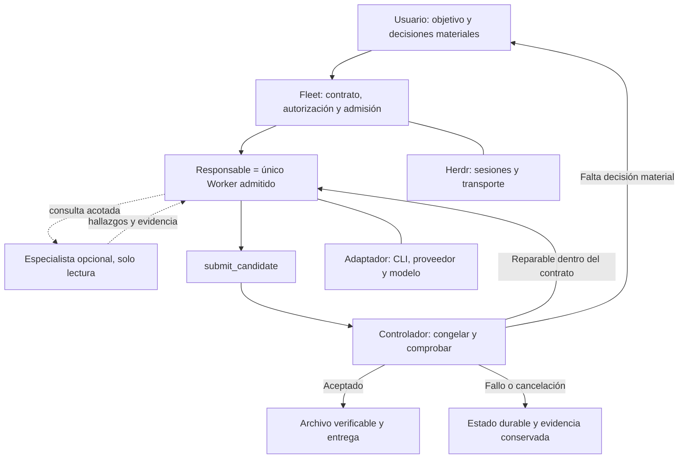

# Playbook de evolución del harness y selección de agentes

Fecha de la propuesta: **19 de septiembre de 2026** (America/Chicago).

Estado: **propuesta guardada para continuar en una sesión nueva; no implementada**.
El usuario autorizó guardar este plan. Guardarlo no habilita su implementación,
crear agentes o Missions, nuevas campañas, instalaciones, commits o despliegues.
Conservar las autorizaciones previas que correspondan a acciones concretas;
no pedirlas de nuevo por el mero cambio de sesión.

## Inicio de la siguiente sesión

Trabajar en `/Users/hector/Projects/agent-fleet-orchestrator`.

1. Leer el `AGENTS.md` vigente y este playbook.
2. Revalidar el estado del checkout y preservar todo el trabajo pendiente.
3. Leer la evidencia local indicada al final; no repetir la auditoría de skills.
4. Empezar por **P0**, distinguiendo implementación existente, propuesta y
   `NOT_VERIFIED`. La primera salida es un baseline y una unidad siguiente
   concreta, con criterios de aceptación; no habilitar dispatch automáticamente.
5. Seguir la instrucción que el usuario dé en la nueva sesión. Si autoriza
   implementación, avanzar por unidades y verificarlas; si pide revisión,
   mantenerla read-only. Este documento no sustituye esa instrucción.

Prompt de reanudación:

> Lee `AGENTS.md` y `docs/harness-execution-playbook-2026-09-19.md`. Retoma en
> P0: revalida el estado actual, preserva los cambios pendientes y revisa la
> evidencia enlazada. No repitas la auditoría de skills. Identifica la primera
> unidad implementable y sus criterios de aceptación, sin implementarla todavía
> ni lanzar nuevas campañas o llamadas de pago. Distingue hechos, propuestas y
> NOT_VERIFIED; no me pidas información que puedas obtener del repositorio.

## Decisión principal

Evolucionar Fleet hacia **un responsable único por tarea, especialistas opcionales
y un controlador que conserve autoridad sobre permisos, recuperación y
aceptación**. DeepSeek y GLM entrarán como ejecutores evaluados, sin convertirlos
en etapas obligatorias.

La prioridad es completar el ciclo y hacer fiable el protocolo de entrega.
Cambiar primero el reparto de modelos dejaría sin resolver problemas observados.
El objetivo es trabajo verificable, no maximizar agentes, etapas o autonomía.

## 1. Punto de partida comprobado

Los hechos de esta sección corresponden a la revisión del 19-09-2026. Revalidar
los que puedan haber cambiado; las líneas citadas son orientativas del snapshot.

| Componente | Estado comprobado | Consecuencia |
| --- | --- | --- |
| `astra_sol_v1` | Cuatro roles y cinco etapas: Plan, Build, Review, Verify, Synthesis. | Conservar como referencia y compatibilidad histórica. |
| `astra_sol_research_v1` | Añade Research: cinco roles y seis etapas. | Reservar para incertidumbre que justifique investigación separada. |
| `sol_minimal_v1` | Un Worker y una etapa Build. | Punto de comparación natural para simplificar. |
| `owner-work-v1` | Preparación y protocolo local; backend rechaza expresamente el dispatch. | Completar el ciclo mediante un perfil nuevo; la previsualización no es un runtime terminado. |
| GLM 5.3 | Ocho revisiones pequeñas con contenido correcto; **0/8 entregas cumplieron el contrato completo de JSON puro**. | Candidato a revisión; integración automática no validada. |
| DeepSeek | Ocho intentos preparados pendientes por credencial accesible. | Selección de harness abierta. |

Referencias del repositorio:

- [`scripts/fleet_herdr_profile.py:65`](../scripts/fleet_herdr_profile.py): perfiles, roles, etapas y escritor.
- [`scripts/fleet_herdr.py:1279`](../scripts/fleet_herdr.py): rechazo de dispatch `owner-work-v1`.
- [`docs/herdr-owner-work-packet.md:73`](herdr-owner-work-packet.md): paquete, envelope y límites del trabajo local.
- [Ensayo local, `REPORT.md:11`](/Users/hector/.local/share/fleet-harness-selection/20260919-01/REPORT.md): resultados, protocolo, incidentes y límites.

## 2. Qué conservar de las investigaciones

| Decisión | Aporte al harness |
| --- | --- |
| Conservar permisos efectivos, único escritor, ledger, CAS, congelación y verificación del archivo. | Integridad y recuperación independientes de la capacidad del modelo. |
| Simplificar etapas obligatorias. | El responsable puede investigar, planificar y reparar sin imponer nuevos contextos y entregas entre agentes. |
| Separar objetivo de contabilidad. | `WorkPacket` informa al agente; `ExecutionEnvelope` retiene identidades, vínculos y autoridad en el controlador. |
| Revisión opcional por otro modelo. | Contraste cuando riesgo o incertidumbre lo justifiquen; medir su beneficio. |
| Comparar configuraciones completas y versionadas. | Modelo, herramientas, contexto, endpoint y entrega influyen en el comportamiento. |
| Medir coste por resultado aceptado. | Incluir fallos, reintentos y llamadas auxiliares; caché y pocos tokens no equivalen a trabajo útil. |

**DeepSeek:** mantener DSH Minimal frente a mini-SWE-agent como primera
comparación. La ficha oficial de V4.1 Flash reporta 72,6/74,2 en DeepSWE y
90,6/90,3 en Terminal-Bench 2.1, respectivamente. Son resultados del fabricante,
no una reproducción nuestra ni un ganador universal. Usa N=8/N=3 muestras por
tarea, Linux y condiciones concretas. [Ficha oficial, revisión `df42c10`,
consultada el 19-09-2026](https://huggingface.co/deepseek-ai/DeepSeek-V4.1-Flash/blob/main/README.md).

**Pi:** alternativa posterior. La comparación de Composio del 08-09-2026 usó
V4 Pro y proveedores distintos (Pi/OpenRouter y DSH/DeepSeek). No resuelve la
elección para Flash en Fleet. No mezclar sus cifras con el panel separado sin
reconciliar las ejecuciones. [Estudio original](https://composio.dev/content/deepseek-harness-vd-pi-agent).

**Uncle Bob:** de la investigación previa conservar la hipótesis de métodos
flexibles y comprobaciones independientes. Su experiencia con Grok no demuestra
que eliminar etapas mejore Fleet. Las publicaciones originales no pudieron
volver a consultarse en la última pasada; esta conclusión procede del registro
de investigación previo. El reparto «responsable + revisor opcional» es una
adaptación propuesta para Fleet, no una receta atribuida a Bob.
[Publicación original](https://x.com/unclebobmartin/status/2098744156709441896).

**Fuera del camino crítico inicial:** Agent Teams, adoptar una arquitectura
completa de plugins, routing con TypeSafe, inferencia local y optimización guiada
solo por caché. TypeSafe sigue siendo un ensayo del consumidor con respuestas
inventadas, no evidencia de calidad del proveedor. Sus umbrales no están
calibrados. [`evals/typesafe_synthetic/README.md:17`](../evals/typesafe_synthetic/README.md).

Correcciones de investigación que no deben perderse:

- El testimonio de 99 % de cache hits del 18-09-2026 correspondía, según la
  aclaración del autor, a **GLM 5.3 Flash y Qwen 3.8 Next Flash autoalojados con
  SGLang en DGX Station**. No mide DeepSeek V4.1 Flash ni nuestro GLM 5.3.
  [Aclaración](https://x.com/TheAhmadOsman/status/2101143691150721126).
- El titular de 17× tokens de HardNumbers del 18-09-2026 usó Qwen3 14B,
  DSH 0.1.2-rc.1 y ocho tareas. Se recalcularon sus datos publicados, pero no se
  repitió el experimento. No evalúa modelos DeepSeek.
  [Experimento](https://hardnumbers.dev/articles/deepseek-harness-vs-opencode-vs-aider-a-17x-token-gap).
- Disponibilidad en un CLI, afirmaciones del fabricante y testimonios de cuota
  sirven para seleccionar candidatos, no para declarar superioridad local.

## 3. Arquitectura y reparto propuestos



| Función | Selección propuesta | Límite |
| --- | --- | --- |
| Responsable de trabajo complejo | Astra, mediante CLI oficial de Codex, en perfil nuevo evaluado. | Si escribe debe ser Worker admitido; Lead sigue siendo lector. |
| Referencia y alternativa operativa | Sol, conservando perfiles actuales. | No retirarlo antes de demostrar mejora. |
| Implementación acotada | DeepSeek V4.1 Flash mediante ganador local DSH Minimal/mini-SWE. | Promoción pendiente de ensayo y adaptación al contrato Fleet. |
| Segunda revisión | GLM 5.3 con Claude Code u OpenCode según validación. | Solo lectura, sin autoridad de aceptación. |
| Aceptación | Controlador, comprobaciones funcionales y revisión independiente cuando corresponda. | El `PASS` de un modelo no determina éxito. |

No activar todos en cada tarea. Cada consulta adicional debe responder una
pregunta concreta. Preservar el CLI oficial de Codex autenticado por ChatGPT
para el carril personal; no introducir un proxy propio de suscripción.

La integración requiere trabajo propio: perfiles actuales validan Codex/OpenAI,
el lector exige esa identidad y `ClaudeAdapter` fija Anthropic. La conexión
experimental GLM/Claude Code no satisface automáticamente estos contratos.
Ver [`fleet_herdr_profile.py:159`](../scripts/fleet_herdr_profile.py),
[`fleet_herdr.py:1843`](../scripts/fleet_herdr.py) y
[`providers/claude.py:10`](../scripts/providers/claude.py).

## 4. Secuencia de ejecución

Cada etapa produce una unidad revisable. El implementador asignado es el único
escritor; revisión y verificación trabajan sobre el candidato congelado.

| Etapa | Trabajo y entregable | Condición para avanzar |
| --- | --- | --- |
| **P0 — Punto de partida** | Inventario de cambios, incluidos untracked e ignored; clasificación del trabajo de alcance físico y owner-work; baseline explícito. | No se pierde ni incorpora por accidente trabajo previo; pendiente y revisado quedan separados. |
| **P1 — Contratos** | Especificación versionada de WorkPacket, ExecutionEnvelope, entrega, decisiones y aceptación; matriz de capacidades de runtime. | Fixtures rechazan identidades falsas, mensajes ambiguos, ampliaciones de autoridad y resultados incompletos. |
| **P2 — Ciclo mínimo** | Persistir intentos/revisiones; submit → check → repair; decisiones, pausa, cancelación y recuperación. Perfil nuevo deshabilitado inicialmente. | Ciclo completo con backend simulado, incluidos fallos e interrupciones; comportamiento histórico preservado. |
| **P3 — Ejecutores** | Adaptadores de identidad, permisos, resultado terminal, consumo y cancelación. | Conformidad sin fabricar evidencia ni degradar controles. |
| **P4 — Modelos y harnesses** | DeepSeek pendiente; entrega estructurada GLM; después comparación representativa contra Sol/Astra. | Cumplimiento completo y utilidad demostrados dentro del ámbito evaluado. |
| **P5 — Piloto opt-in** | Perfil nuevo en tareas acotadas, límites registrados y seguimiento. | Sin falsas aceptaciones, pérdida de estado ni cambios fuera de alcance observados. |
| **P6 — Simplificar por resultados** | Retirar del flujo predeterminado etapas/modelos sin mejora medible. | Mantener calidad/recuperación y reducir intervención, tiempo o consumo. |

P0–P3 pueden avanzar principalmente con fixtures y dependencias existentes.
P4 distingue continuar los ocho intentos DeepSeek ya aprobados de autorizar una
campaña nueva. No ampliar silenciosamente el ensayo congelado.

### P1: entrega estructurada

Probar una herramienta de resultado o salida estructurada realmente soportada
por el runtime. Alternativa: canal estricto con reparación acotada y registrada.

El controlador conserva respuesta original, separa mensajes intermedios del
terminal, valida esquema y vincula sesión/turno/intento. Calcula identidades y
hashes. Un resultado inválido queda inválido; una reparación es otro intento
observable. Validez del mensaje, aceptación del artefacto y objetivo son estados
distintos.

Aprovechar la preparación existente. El enlace durable de las interacciones está
pendiente: [`fleet_herdr_owner_protocol.py:88`](../scripts/fleet_herdr_owner_protocol.py).

**Riesgo:** abstracción no soportada por CLI/proveedor. Verificar por combinación
qué hace el modelo, qué ofrece la API, qué expone el CLI y qué construye Fleet.
JSON válido tampoco acredita corrección funcional. No reparar respuestas a
escondidas para transformar resultados del ensayo en PASS.

### P2: reparación, contexto y recuperación

Cada entrega produce una revisión inmutable. Un fallo reparable vuelve al
responsable y genera otra revisión; el archivo anterior permanece intacto.

Fijar límites de intentos, tiempo y consumo antes de ejecutar y aplicarlos donde
puedan observarse. Contadores ausentes siguen desconocidos. Cambiar alcance o
aceptación requiere una enmienda explícita. Ningún retry renueva autoridad o
presupuesto silenciosamente.

Conservar objetivo, restricciones, decisiones, última revisión, comprobaciones,
pendientes, identidades, recursos propios, plazo original y evidencia de envíos
ambiguos. Mantener el historial como evidencia consultable; cargar una síntesis
acotada con referencias en el contexto activo. No introducir memoria global
nueva para resolver esta necesidad operativa.

Mantener reconciliación del mismo envío, pausa solicitada/confirmada y cancelación
exacta. [`herdr-supervision-and-measurement.md:27`](herdr-supervision-and-measurement.md).

**Riesgo:** reparación infinita o reapertura de terminales. Salidas explícitas:
éxito comprobado, bloqueo, agotamiento o cancelación. No modificar las reglas
históricas de `sol_minimal_v1` para habilitar el ciclo nuevo.

### P3: capacidades y fronteras

| Capacidad | Evidencia |
| --- | --- |
| Identidad | CLI/versión, proveedor, modelo observado y sesión vinculada. |
| Entrega | Mensaje terminal inequívoco y contrato validado. |
| Permisos | Configuración registrada y controles efectivos de archivos, red y herramientas. |
| Recuperación | Distinguir no enviado, envío ambiguo y resultado recuperable. |
| Cancelación | Recursos propios identificables y confirmación de inactividad. |
| Medición | Contadores, procedencia y desconocidos explícitos. |

No sustituir aislamiento por instrucciones. Alcance físico comprueba snapshots
y bytes entregados, no ausencia de escrituras transitorias o efectos externos.
[`herdr-physical-scope.md:98`](herdr-physical-scope.md).

DSH debe usar versión fijada y adaptador propio. Sigue en developer preview con
cambios incompatibles anunciados. [Repositorio oficial, consultado el
19-09-2026](https://github.com/deepseek-ai/deepseek-harness).

### P4–P6: promoción y retroceso

Para DeepSeek, resolver acceso seguro a la credencial y continuar los ocho
intentos preparados con sus condiciones. No reemplazar modelo o endpoint para
desbloquear artificialmente la comparación; no exponer secretos en chat/logs.

Para GLM, conservar baseline y cambiar primero el mecanismo de entrega. OpenCode
fue más rápido en mediana; Claude Code consumió menos y tuvo menor coste estimado.
Cuatro observaciones por harness no resuelven la selección.

Empezar piloto opt-in con una Mission activa. Ante falsa aceptación, efecto no
autorizado o pérdida de recuperación:

1. Detener nuevas admisiones del perfil afectado.
2. Reconciliar ejecuciones abiertas y preservar evidencia.
3. Volver al perfil anterior para **nuevas** Missions.
4. Corregir y repetir casos pertinentes antes de promover otra versión.

## 5. Playbook operativo de una tarea

1. **Recibir:** objetivo, alcance, evidencia disponible y resultado observable.
2. **Preparar:** baseline, instrucciones, permisos y criterios de aceptación.
3. **Admitir:** responsable/ejecutor compatible, límites y recursos registrados.
4. **Trabajar:** planificación e investigación según necesidad; consultas
   adicionales acotadas y autorizadas.
5. **Entregar:** describir cambios, evidencia y limitaciones.
6. **Comprobar:** congelar revisión y ejecutar alcance/aceptación sobre esos bytes.
7. **Resolver:** reparar dentro del contrato, pedir decisión material o terminar
   con dependencia concreta.
8. **Cerrar:** verificar archivo y recursos; entregar evidencia y limitaciones.
   Integrar al origen conserva su autorización propia.

Reutilizar skills ya auditadas mediante selección explícita y contenido
vinculado. No repetir auditoría ni copiar instrucciones globales a cada agente.

## 6. Validación proporcional

Los tamaños siguientes son una propuesta, no campañas autorizadas o ejecutadas.
Fijar criterios antes de ver resultados.

| Nivel | Muestra | Decisión |
| --- | --- | --- |
| Conformidad local | Fixtures de protocolo, alcance, identidad y recuperación. | Si controlador/adaptadores respetan contratos. |
| Ensayo pequeño | DeepSeek pendiente y comparación GLM de entrega. | Si continuar con cada configuración. |
| Piloto representativo | Inicialmente 12 tareas × 3 repeticiones por configuración finalista. | Mejora operativa consistente, con incertidumbre de muestra explícita. |

Cobertura: correcciones pequeñas y entre archivos; implementación con varios
requisitos; revisión defectuosa y limpia; investigación con fuentes
contradictorias; decisiones ambiguas; interrupción; envío ambiguo; cancelación;
rechazo de efectos fuera de alcance; preservación de archivos ignorados.

Comparar primero el mismo modelo entre harnesses. Después políticas completas,
como Sol actual frente a Astra responsable con revisión GLM condicional. No
cambiar modelo, permisos, tareas y evaluador simultáneamente y atribuirlo a un
componente. Conservar proveedor, límites y criterios comunes; declarar las
diferencias inevitables de thinking, herramientas y runtime. Evaluar revisión
opcional contra el mismo flujo sin ella; no asumir que aporta por existir.

Criterios comunes: objetivo satisfecho, sin regresiones relevantes, alcance
respetado, evidencia reproducible, entrega válida y estado conservado. Donde el
runner no pueda comprobar un requisito, definir contrato o rúbrica independiente.
El perfil Python existente no acredita tareas generales. Para revisión manual,
preferir evaluación ciega cuando sea viable y declarar quién evaluó.

| Métrica | Medición |
| --- | --- |
| Calidad | Tareas aceptadas, requisitos, defectos omitidos y falsos positivos. |
| Falsa aceptación | Éxito declarado incumpliendo objetivo o autoridad; cualquier caso bloquea promoción. |
| Intervención humana | Acceso inicial, decisiones necesarias, correcciones y rescates por separado. |
| Recuperación | Continuaciones correctas, duplicados, pérdida de evidencia y recursos pendientes. |
| Tiempo | Hasta aceptación, mediana/dispersión; ejecución, espera y reparación separadas. |
| Consumo | Tokens, caché, auxiliares y fallos; coste de todos los intentos / tareas aceptadas. Facturación desconocida = null. |
| Mantenimiento | Incidentes de compatibilidad, excepciones por runtime y esfuerzo de diagnóstico. |

Promover con cero violaciones observadas de autoridad/falsas aceptaciones,
recuperación satisfactoria y mejora útil en calidad, intervención, tiempo o coste
sin regresión material en otras dimensiones. Cero incidentes en una muestra no
demuestra imposibilidad de fallo. Si la muestra no distingue alternativas,
conservar perfil actual y preferir menor mantenimiento; ampliar solo cuando
la incertidumbre pueda cambiar la decisión.

## 7. Evidencia para continuidad

Directorio del ensayo existente:
`/Users/hector/.local/share/fleet-harness-selection/20260919-01`.

| Archivo | Uso |
| --- | --- |
| [REPORT.md](/Users/hector/.local/share/fleet-harness-selection/20260919-01/REPORT.md) | Informe completo, interpretación y límites. |
| [summary.json](/Users/hector/.local/share/fleet-harness-selection/20260919-01/summary.json) | Agregados y estado GLM_COMPLETE_DEEPSEEK_BLOCKED_CREDENTIAL. |
| [results.json](/Users/hector/.local/share/fleet-harness-selection/20260919-01/results.json) | Resultados por intento y revisión manual. |
| [protocol.json](/Users/hector/.local/share/fleet-harness-selection/20260919-01/protocol.json) | Alcance y límites originales. |
| [freeze.json](/Users/hector/.local/share/fleet-harness-selection/20260919-01/freeze.json) | Entradas congeladas; consultar también FREEZE.sha256. |
| [research-verification.json](/Users/hector/.local/share/fleet-harness-selection/20260919-01/research-verification.json) | Fuentes externas, fechas, correcciones y límites. |
| [hardnumbers-recalculation.json](/Users/hector/.local/share/fleet-harness-selection/20260919-01/hardnumbers-recalculation.json) | Recálculo de datos públicos, sin repetir benchmark. |
| [continuation-amendment.json](/Users/hector/.local/share/fleet-harness-selection/20260919-01/continuation-amendment.json) | Continuación tras recarga, fail-fast y seguimiento de procesos. |
| [evaluation-amendment.json](/Users/hector/.local/share/fleet-harness-selection/20260919-01/evaluation-amendment.json) | Corrección del extractor de mensaje final OpenCode. |

Recordatorio de resultados GLM: cuatro intentos por harness, dos fixtures
pequeños, evaluación manual no ciega, mismo endpoint Z.ai, identidad observada
`glm-5.3` (no Flash). Claude Code 2.1.270 frente a OpenCode 1.18.30. Contenido
correcto 4/4 cada uno, JSON estricto 0/4 cada uno, candidatos intactos 4/4 cada
uno. Medianas 197,013 s y 157,614 s. Costes estimados sin descuento de caché
0,2832334 y 0,3531198 USD; total 0,6363532 USD, facturación desconocida.

Hubo 51 solicitudes exitosas al proveedor. El dispatch previo bloqueado por
saldo (siete rechazos, sin respuesta de modelo) queda conservado aparte; no es
un fallo de calidad. Claude usó adaptive thinking y OpenCode enabled thinking
con budgetTokens=32768: no se aisló causalmente esa diferencia.

Límites originales de campaña: 16 intentos totales, 600 s y 32 solicitudes por
intento, 10 USD estimados, concurrencia uno. Los ocho intentos DeepSeek no se
enviaron. La autorización previa no cubre ampliaciones silenciosas o nuevos
ensayos. Confirmar el contrato congelado al retomar.

La clave DeepSeek se había usado históricamente, pero no estaba accesible en
los entornos/localizaciones acotadas revisadas. Se pidió su ruta local o terminal,
nunca el secreto. Revalidar acceso; no afirmar que la clave nunca existió ni
buscar/exponer credenciales ajenas. No repetir preguntas ya respondidas.

No se probó recuperación live deliberada; coste facturado y calidad general
siguen `NOT_VERIFIED`. Al cerrar el ensayo no quedaron procesos/contenedores
propios. Es una observación histórica, no un inventario de la próxima sesión.

## 8. Trabajo pendiente que debe preservarse

HEAD observado al guardar: `a029f0a2d84dbc445a7ad3b8a09d36b904431e32`.
El checkout ya estaba sucio; guardar este archivo no integra ni aprueba lo demás.
Antes de guardar se registró en la sesión un inventario de 406 archivos tracked
o no ignorados para comprobar que permanecieran intactos. Ese inventario no
incluye ignored y no acredita igualdad física total.

Modificados previamente:

```text
AGENTS.md
docs/herdr-mission-control.md
orchestration/role-skills/codex-os/SKILL.md
orchestration/role-skills/deep-research/SKILL.md
orchestration/role-skills/smoke-verify/SKILL.md
scripts/fleet_herdr.py
scripts/fleet_herdr_archive.py
scripts/fleet_herdr_mission.py
scripts/fleet_mission.py
scripts/fleet_mission_state.py
scripts/mission-run.py
```

No versionados previamente:

```text
docs/herdr-owner-work-packet.md
docs/herdr-physical-scope.md
evals/typesafe_synthetic/
scripts/fleet_herdr_owner_protocol.py
scripts/fleet_herdr_scope.py
scripts/fleet_herdr_work_packet.py
tests/test_fleet_herdr_scope.py
tests/test_fleet_herdr_work_packet.py
```

La existencia de estos archivos no acredita aprobación, verificación funcional
completa ni incorporación al runtime. La historia de la auditoría incluye trabajo
de owner-work iniciado fuera del alcance read-only; P0 debe aclarar la revisión
y aceptación de cada unidad, sin borrarla, reimplementarla o integrarla por defecto.
No dar por reproducidos tests reportados en documentación o sesiones anteriores.
