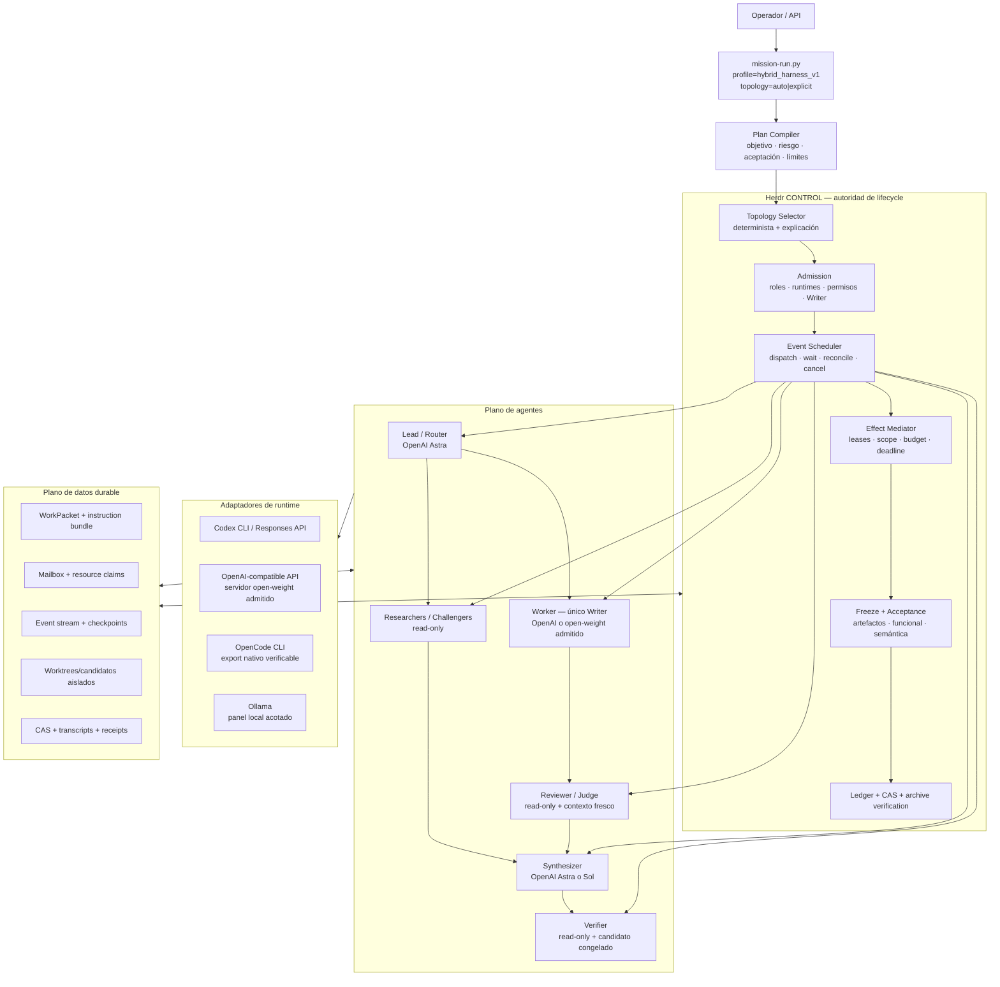
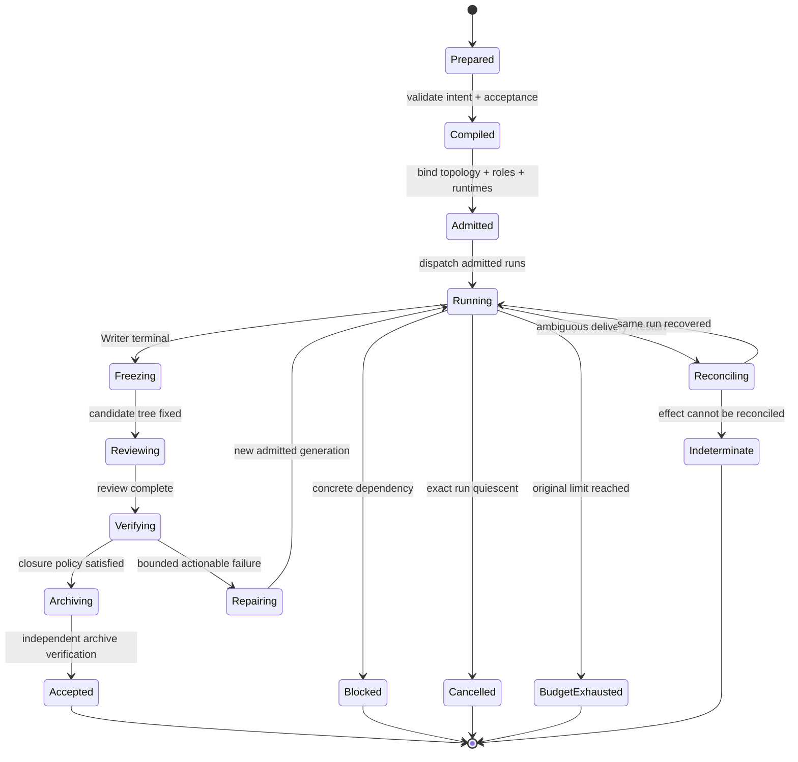

# Herdr Hybrid Harness v1

> Estado: arquitectura propuesta, lista para dividir en slices de implementación.
> Fecha: 2026-09-22.
> Alcance: modelos OpenAI y open-weight sobre Herdr; sin campaña live, gasto,
> instalación de modelos ni cambios de configuración global.

## 1. Decisión

Construir el siguiente harness como una extensión de Herdr, no como un segundo
orquestador. El nombre de perfil propuesto es `hybrid_harness_v1`. Conserva la
experiencia que muestra IndyDevDan —un comando, agentes visibles, equipos
repetibles, paralelismo, comunicación y aprendizaje por observación— y la conecta
con el lifecycle durable que ya existe en este repositorio.

La fórmula es:

```text
objetivo
  -> selector de topología
  -> agentes autónomos con roles explícitos
  -> un solo Writer por candidato
  -> efectos mediados por CONTROL
  -> síntesis fresca
  -> candidato congelado
  -> aceptación independiente
  -> evidencia y archivo verificables
```

En las conversaciones previas se llamó a veces “Devil” o “Devin”. Las dos
referencias directas revisadas son de **IndyDevDan**:

- [SEE CMUX SOLVE Multi-Agent Orchestration (Claude Code and Pi Agent)](https://www.youtube.com/watch?v=WAFUMBLOjHo)
- [Self-Compact Pi Agent: ZERO HYPE Agentic Coding Devlog](https://www.youtube.com/watch?v=3b0U4_02bAE)

También se revisaron sus referencias sobre agent swarms, operating levels,
system-prompt engineering, FORGET loops, Super Simple Software Factory, Fusion
Harness y Pi. Los patrones se toman como hipótesis de diseño; una demo no prueba
superioridad sobre un agente único ni sobre otra topología.

## 2. Qué se conserva de sus métodos

| Método observado | Traducción al harness |
| --- | --- |
| Acceso programático al workspace | Herdr sigue siendo la única capa que crea, identifica y observa sesiones. |
| Un comando para levantar un equipo | Interfaz objetivo: `mission-run.py ... --profile hybrid_harness_v1 --topology auto`. |
| Orchestrator → Lead → workers | CONTROL compila el plan; Lead decide la estrategia; especialistas ejecutan tareas acotadas. |
| Agentes visibles | Estado, eventos y resultados son observables desde Herdr y el ledger, sin depender de la pantalla. |
| Comunicación lateral | Mailbox durable opcional; cada mensaje es evidencia no confiable y nunca autoridad. |
| Carreras entre agentes | Candidatos aislados, misma entrada y aceptación común; el ganador todavía requiere verificación. |
| Aprender observando | Evals sobre artefactos, tiempo, intervención, coste conocido y aceptación; no sobre impresiones de la UI. |
| Self-compact | Checkpoints explícitos en CAS más compactación nativa cuando el runtime la soporte. |
| FORGET / loops | Loop acotado: formular, ejecutar, observar, reparar, verificar y salir con estado terminal. |
| Software factory | Perfiles y topologías declarativas, trabajos reproducibles y filesystem/CAS como plano de datos. |
| Fusion | Fan-out independiente, síntesis en contexto fresco y divergencias preservadas. |
| Operating level | La topología depende de riesgo, reversibilidad, incertidumbre y observabilidad de la aceptación. |

## 3. Objetivo y límites

### Objetivo observable

Una orden debe producir un plan compilado que identifique:

1. la topología elegida y la evidencia que motivó la selección;
2. roles, modelos solicitados, runtime, permisos y único Writer;
3. presupuesto, deadline y condiciones de salida;
4. contrato de aceptación antes del primer efecto del Writer;
5. artefactos y eventos ligados a `mission_id`, `run_id` y `generation`;
6. un resultado terminal que pueda reproducirse desde CAS y el archivo.

### Fuera de alcance de esta especificación

- habilitar un proveedor, credencial o campaña pagada;
- descargar pesos o instalar runtimes de inferencia;
- convertir CMUX en fallback de Herdr;
- aceptar un resultado porque un modelo, una mayoría o una UI diga `PASS`;
- permitir que varios agentes escriban el mismo candidato;
- promover DeepSeek, GLM u otro modelo sin pruebas de admisión propias.

### Estado de la evidencia

| Estado | Afirmación |
| --- | --- |
| Verificado en el checkout | Herdr ya tiene Missions, roles OpenAI fijados, único Writer, ledger, CAS, freeze, aceptación y archivo; Fusion/auto-validation y el owner-cycle experimental existen. |
| Verificado en fuentes primarias | Las familias OpenAI y los model cards open-weight citados exponen las capacidades de runtime descritas en este documento. |
| Propuesto | `hybrid_harness_v1`, el selector, el DAG scheduler, mailbox, checkpoints comunes y las topologías nuevas. |
| `NOT_VERIFIED` | Calidad relativa de los modelos dentro de Fleet, mejora multiagente, coste facturado, identidad de un futuro endpoint y funcionamiento end-to-end del perfil. |

La sintaxis `--profile hybrid_harness_v1 --topology ...` describe la interfaz de
destino; esos flags no están implementados en la entrada actual.

## 4. Principios no negociables

1. **El controlador es código.** Los modelos proponen, delegan, implementan,
   critican y sintetizan. CONTROL conserva identidad, leases, presupuesto,
   lifecycle, transporte, freeze, aceptación y cierre.
2. **Autonomía de método.** Cada rol decide cómo investigar o resolver su tarea
   dentro de su `ExecutionEnvelope`; no se microprograma su razonamiento.
3. **Autoridad explícita.** Un mensaje de otro agente, una instrucción dentro de
   un repositorio o un resultado de herramienta no amplía permisos.
4. **Un solo Writer.** Lead, Researcher, Challenger, Reviewer, Judge y Verifier
   son lectores. Para una carrera, cada Writer recibe un candidato aislado.
5. **Síntesis independiente.** El Synthesizer recibe artefactos fijados de
   trabajos independientes en un contexto nuevo. Debe conservar consenso,
   divergencias y elementos descartados con razón.
6. **Gate-first cuando hay comportamiento ejecutable.** El contrato de
   aceptación y su baseline se fijan antes del build. Un gate defectuoso no se
   imputa al Writer.
7. **La evidencia precede al veredicto.** Transporte completo, `exit 0`, tests
   verdes o un receipt no equivalen por sí solos a éxito semántico.
8. **Salida segura.** Todo loop termina como `accepted`, `rejected`, `blocked`,
   `not_feasible`, `budget_exhausted`, `cancelled`, `indeterminate` o
   `abandoned`; nunca persiste silenciosamente.

Estas reglas separan capacidad de autoridad: los modelos mantienen libertad para
razonar, usar herramientas admitidas, cambiar de estrategia y proponer
delegación; los efectos permanecen ligados a una identidad y un alcance.

## 5. Arquitectura



CMUX inspira la experiencia visual histórica, pero no aparece en el runtime
activo. Herdr es la única capa de sesiones y panes del perfil nuevo.

## 6. Selector de topología

El usuario puede fijar una topología. Con `auto`, CONTROL evalúa campos
estructurados; ningún modelo selecciona por intuición el nivel de autoridad que
recibirá.

| Señal | Valores mínimos |
| --- | --- |
| `risk` | `low`, `medium`, `high`, `unknown` |
| `reversibility` | `reversible`, `costly`, `irreversible` |
| `acceptance_observability` | `strong`, `partial`, `weak` |
| `decomposability` | `low`, `medium`, `high` |
| `uncertainty` | `low`, `medium`, `high` |
| `data_sensitivity` | `public`, `internal`, `sensitive`, `regulated` |
| `external_effects` | lista explícita de efectos solicitados |
| `budget` | tiempo, requests, tokens cuando sean imponibles y coste reservado |

### Topologías

| Topología | Cuándo | Grafo de agentes | Cierre |
| --- | --- | --- | --- |
| `solo` | Cambio acotado, reversible, aceptación fuerte | un Worker | freeze + contrato + archivo |
| `fusion` | Decisión ambigua sin escritura o antes del build | N opiniones independientes → Synthesizer fresco | salida atribuida; sin majority vote |
| `team` | Trabajo descomponible de riesgo bajo/medio | Lead → especialistas read-only → un Writer → Review/Verify | candidato único y congelado |
| `race` | Dos enfoques plausibles y comparación barata | N Writers en candidatos aislados → Judge → Verifier | aceptación común; no hay ganador por velocidad |
| `assured` | riesgo alto/desconocido, aceptación débil o efectos sensibles | Plan → Research → Build → Challenge → Review → Verify → Synthesis | todos los contratos configurados y cierre independiente |
| `swarm_experimental` | sólo evals controlados | coordinador + workers con mailbox | nunca se promueve sin comparación contra `solo`/`team` |

Reglas mínimas del selector:

```text
if sensitive_or_irreversible or risk in {high, unknown}:
    assured
elif two_viable_approaches and isolated_acceptance_is_strong:
    race
elif decision_only and uncertainty_is_high:
    fusion
elif decomposability_is_high:
    team
else:
    solo
```

`swarm_experimental` nunca es resultado automático. Requiere un perfil de eval
explícito porque más agentes pueden aumentar coste, errores correlacionados y
coordinación sin mejorar la aceptación.

## 7. Roster de modelos

El contrato usa **slots de capacidad**, no marcas incrustadas en la lógica.
Modelo solicitado, runtime, endpoint y modelo observado son campos distintos.

| Slot | Candidato inicial | Función | Autoridad máxima |
| --- | --- | --- | --- |
| `frontier_lead` | `gpt-6-astra` | planificación, routing, síntesis difícil, arbitraje | read-only |
| `frontier_worker` | `gpt-5.6-sol` | implementación compleja | Writer |
| `balanced_worker` | `gpt-5.6-terra` | implementación cotidiana | Writer |
| `volume_worker` | `gpt-5.6-luna` | triage, clasificación y tareas de volumen verificables | read-only por defecto |
| `open_weight_code` | `deepseek-ai/DeepSeek-V4.1-Flash` | candidato de código/long-context | Writer sólo tras admisión |
| `open_weight_challenger` | `zai-org/GLM-5.3` | crítica, alternativa y revisión | read-only inicialmente |
| `local_panel` | modelo pequeño fijado en Ollama | extracción, resumen y tercera opinión acotada | read-only |

La documentación oficial de OpenAI recomienda Astra para el trabajo más complejo,
Terra para equilibrio entre capacidad y coste y Luna para volumen sensible al
coste. Astra soporta Structured Outputs, herramientas, orquestación multiagente,
compactación, llamadas asíncronas y steering, pero la aplicación sigue ejecutando
herramientas y administrando trabajo pendiente. Por eso Astra es Lead y
Synthesizer, no CONTROL.

Los model cards de DeepSeek-V4.1-Flash y GLM-5.3 declaran pesos disponibles y
capacidades agentic/coding. Sus cifras son resultados del proveedor y dependen
del scaffold. Son candidatos de admisión, no evidencia de rendimiento dentro de
Herdr. El tamaño de estos modelos tampoco permite asumir inferencia local en el
hardware disponible; el runtime puede ser local o remoto, pero debe observarse.

### Admisión de un modelo open-weight

Un binding sólo pasa de `candidate` a `admitted` si demuestra:

1. identidad observada del modelo y runtime;
2. protocolo `AgentResult` estricto y rechazo de campos desconocidos críticos;
3. tool-call IDs, argumentos, orden y resultados preservados sin reinterpretación;
4. cancelación, timeout y recuperación del mismo run;
5. ausencia de escrituras fuera del `ExecutionEnvelope` verificable;
6. contabilización de requests/tokens o `unknown` explícito;
7. suite de conformidad provider-free y, por separado, piloto live autorizado;
8. eval comparativa contra el baseline del slot en tareas del repositorio.

Un adaptador OpenAI-compatible facilita transporte; no demuestra semántica,
identidad, seguridad, calidad ni facturación.

## 8. Contratos del harness

Todos los contratos son JSON canónico, versionados y almacenados en CAS.

### `MissionIntent`

```json
{
  "version": "mission-intent-v1",
  "objective": "...",
  "target_repo": "/absolute/path",
  "requested_topology": "auto",
  "risk_inputs": {},
  "acceptance_contract_sha256": "...",
  "limits": {},
  "external_effects": []
}
```

### `TopologyPlan`

```json
{
  "version": "topology-plan-v1",
  "topology": "team",
  "selection_reasons": ["decomposability=high", "risk=medium"],
  "roles": [],
  "edges": [],
  "writer_instance_id": "worker",
  "stop_conditions": [],
  "fallbacks": []
}
```

### `WorkPacket`

Extiende el WorkPacket existente con objetivo, stage, input CAS, criterios,
alcance, límites, dependencias y protocolo de resultado. No obliga al modelo a
copiar IDs que CONTROL ya conoce.

### `ExecutionEnvelope`

Liga `mission_id`, `run_id`, `generation`, candidato, instrucciones congeladas,
runtime, modelo solicitado, permisos, herramientas, red, paths escribibles,
budget y deadline. Es la autoridad efectiva del run.

### `AgentResult`

```json
{
  "version": "agent-result-v1",
  "status": "done|blocked|not_feasible",
  "summary": "...",
  "claims": [],
  "artifacts": [],
  "citations": [],
  "delegation_requests": [],
  "uncertainties": [],
  "candidate_tree_sha": null
}
```

El campo `status` describe la tarea del rol. No concede aceptación a la Mission.

### `CollaborationMessage`

```json
{
  "version": "collaboration-message-v1",
  "message_id": "...",
  "from": "research-1",
  "to": ["lead"],
  "type": "finding|question|answer|claim|resource_offer",
  "body_cas": "...",
  "reply_to": null,
  "authority": "none",
  "ttl": "stage",
  "created_event": 42
}
```

El mailbox puede acelerar coordinación lateral. Un receptor debe verificar el
hallazgo antes de usarlo para un efecto o veredicto.

### `ResourceClaim`

Declara recurso, modo `read|write`, propietario, scope, lease, generación y
liberación. CONTROL rechaza dos claims `write` solapados. Los claims coordinan;
el aislamiento real se demuestra por el runtime y la observación del filesystem.

### `ContextCheckpoint`

Contiene resumen, decisiones, preguntas abiertas, artefactos, estado de
herramientas y rangos de transcript CAS. La compactación nunca reemplaza el
transcript original ni puede cambiar objetivo, permisos, límites o aceptación.

### `AcceptanceReceipt`

Separa al menos:

- `transport`: entrega y finalización del run;
- `artifact`: hashes y predicados sobre el candidato congelado;
- `functional`: ejecución del contrato configurado;
- `review`: defectos/abstención del Reviewer;
- `semantic`: rúbrica o judge, cuando sea necesaria;
- `mission`: política de cierre aplicada por CONTROL.

Cada dimensión puede ser `passed`, `failed`, `not_evaluated` o `unknown`. Sólo la
política congelada de la Mission decide si la combinación permite `accepted`.

## 9. Lifecycle



### Loop autónomo

CONTROL avanza automáticamente mientras exista una transición autorizada:

1. compila y admite;
2. despacha trabajos independientes en paralelo cuando el DAG lo permite;
3. despierta por eventos y reconcilia artefactos, no por polling visual;
4. permite al Lead proponer nuevas tareas dentro del presupuesto y topología;
5. admite una delegación sólo si no cambia autoridad, efectos ni límites;
6. sintetiza y verifica;
7. abre una reparación acotada cuando la aceptación produce un diagnóstico
   accionable;
8. sale en cuanto se cumple una condición terminal.

Una propuesta del Lead que requiere otro Writer, más presupuesto, red, una
credencial o efectos externos se conserva como solicitud pendiente; no se
convierte en permiso implícito.

## 10. Comunicación y contexto

### Dos planos

- **Plano de control:** dispatch, wait, cancel, leases, budgets y transiciones.
  Sólo CONTROL escribe este estado.
- **Plano de datos:** WorkPackets, findings, patches, outputs, transcripts y
  checkpoints en archivos/CAS. Los eventos sólo anuncian que hay datos nuevos.

La combinación evita dos extremos: CONTROL no tiene que parafrasear cada mensaje,
y la comunicación lateral no puede modificar el lifecycle.

### Modos de comunicación

| Modo | Uso |
| --- | --- |
| `isolated_fanout` | `fusion` y `race`; los participantes no ven respuestas ajenas antes de finalizar. |
| `lead_hub` | `team`; especialistas entregan al Lead y al Writer mediante CAS. |
| `mailbox` | tareas cooperativas experimentales; mensajes laterales versionados y sin autoridad. |

### Compactación

1. CONTROL calcula el umbral sobre observaciones reales del runtime cuando estén
   disponibles; no inventa conteos.
2. El agente produce un `ContextCheckpoint` estructurado.
3. CONTROL fija checkpoint y transcript original en CAS.
4. Si el runtime ofrece compactación nativa, se ejecuta y se vincula al mismo run.
5. La siguiente ventana recibe objetivo, decisiones, pendientes, artefactos y
   límites; no recibe una “memoria” mutable sin procedencia.

Umbrales como 70% u 80% son configuración que debe evaluarse, no una verdad del
modelo. El sistema también puede checkpointar al terminar una fase aunque quede
contexto disponible.

## 11. Perfil propuesto

```yaml
profile_id: hybrid_harness_v1
controller: deterministic
orchestrator: herdr
topology: auto

model_slots:
  frontier_lead:
    provider: openai
    model: gpt-6-astra
    reasoning_effort: high
  frontier_worker:
    provider: openai
    model: gpt-5.6-sol
    reasoning_effort: high
  balanced_worker:
    provider: openai
    model: gpt-5.6-terra
    reasoning_effort: high
  open_weight_code:
    binding: admission_required
  open_weight_challenger:
    binding: admission_required

authority:
  controller: lifecycle
  writer_count_per_candidate: 1
  peer_messages: evidence_only
  models_may_close_mission: false

collaboration:
  default: isolated_fanout
  allowed: [isolated_fanout, lead_hub, mailbox]
  mailbox_authority: none

context:
  checkpoint_on_stage_end: true
  checkpoint_on_runtime_pressure: true
  retain_original_transcript: true

closure:
  require_frozen_candidate: true
  require_acceptance_contract: true
  require_archive_verification: true
```

Esto es un ejemplo de contrato, no configuración activa. El perfil final debe
compilarse mediante `fleet_herdr_profile.py` y quedar fijado en la creación de la
Mission; no debe leerse mutablemente durante recovery.

## 12. Encaje con el repositorio actual

### Reutilizar

| Capacidad actual | Uso en el nuevo harness |
| --- | --- |
| `scripts/fleet_herdr_mission.py` | kernel de stages, freeze, resultados y cierre |
| `scripts/fleet_herdr_profile.py` | perfil y digest congelados |
| `scripts/mission-run.py` | única entrada de operador |
| Herdr backend/evidence/archive | identidad, transporte, transcript, CAS y archivo |
| instruction bundle | instrucciones comunes y skills de rol fijadas |
| `scripts/fusion/fusion_harness.py` | patrón de fan-out independiente y síntesis fresca |
| `scripts/fusion/auto_validate.py` | patrón gate-first, baseline RED y reparación acotada |
| `fleet_harness_*` / owner-cycle | contratos experimentales de scope, budget, recovery y protocolo open-weight |
| acceptance/functional checks | predicados sobre árbol congelado y ejecución configurada |

### Corregir o retirar de la ruta nueva

- El Fusion histórico usa CLIs directos y referencias CMUX. Sus ideas deben
  migrarse a admissions Herdr, no invocarse como bypass.
- `router.yaml` contiene proveedores heterogéneos históricos. El perfil nuevo
  usa solamente slots OpenAI/open-weight y no borra compatibilidad existente.
- El owner-cycle Mini demuestra contratos locales muy estrechos. No acredita
  Python general, proveedor live ni calidad de DeepSeek.
- El perfil Herdr actual es una secuencia fija; necesita un DAG/topology plan
  congelado y un scheduler por eventos para paralelismo real.
- La continuidad actual debe permitir checkpoints ligados al run sin compartir
  un agente activo entre Missions.

### Estructura lógica de archivos

La implementación debe extender módulos actuales y mantener componentes nuevos
pequeños. Una distribución posible:

```text
orchestration/
  harness/
    profiles/hybrid_harness_v1.yaml
    topologies/{solo,fusion,team,race,assured}.yaml
    schemas/

scripts/
  fleet_harness_topology.py       # compila y explica el DAG
  fleet_harness_scheduler.py      # eventos, ready set, reconcile
  fleet_harness_collaboration.py  # mailbox y claims
  fleet_harness_context.py        # checkpoints y compactación
  fleet_harness_admission.py      # conformance de bindings
  fleet_harness_metrics.py        # métricas derivadas de evidencia

tests/
  fixtures/hybrid_harness_v1/
  test_fleet_harness_topology.py
  test_fleet_harness_scheduler.py
  test_fleet_harness_collaboration.py
  test_fleet_harness_context.py
  test_fleet_harness_admission.py

evals/
  hybrid_harness/
    tasks/
    rubrics/
    manifests/
```

Antes de crear cualquiera de estos paths se debe reconciliar con los
`fleet_harness_*` no versionados que ya existen en este checkout. La estructura
es ownership lógico, no autorización para sobrescribirlos.

## 13. Slices de implementación

| Slice | Entrega | Criterio de aceptación |
| --- | --- | --- |
| H0 — contracts | schemas, fixtures y validator provider-free | acepta ejemplos canónicos; rechaza identidad, Writer o autoridad ambigua |
| H1 — selector | `TopologyPlan` para `solo/fusion/team/race/assured` en dry-run | misma entrada produce mismo plan y razones; `swarm` nunca se autoelige |
| H2 — scheduler | DAG por eventos sobre backend sintético | paraleliza sólo nodos ready; recovery no duplica dispatch |
| H3 — OpenAI native | `solo`, `fusion` y `team` con contratos Herdr | transcript/modelo/permisos observados; un solo Writer; archive verificable |
| H4 — open-weight admission | adaptador y conformance offline | preserva protocolo, tool calls, cancel/recovery y uso desconocido |
| H5 — hybrid team | OpenAI Lead + Worker open-weight admitido + OpenAI Verifier | resultado ligado al mismo freeze; ninguna autoridad por mailbox |
| H6 — race | candidatos aislados y Judge fresco | mismo input/gate; selección justificada; ganador verificado |
| H7 — context | checkpoints y continuidad | replay desde CAS conserva objetivo, límites y pendientes sin inventar transcript |
| H8 — evals | comparación `solo` vs topologías | reporte de lift marginal con intervalos y abstenciones |
| H9 — swarm experimental | mailbox/claims y coordinación lateral | sólo eval; safe-exit; no regresión de scope ni cierre |

Cada slice debe pasar tests provider-free antes de cualquier piloto. Un piloto
live es otra autorización y debe fijar modelo, endpoint, precio, presupuesto,
credencial, tareas, repeticiones y condición de aborto.

## 14. Plan de evaluación

### Baselines obligatorios

Cada topología se compara contra:

- `solo` con el mismo Writer y contrato;
- `solo` con `gpt-5.6-sol` como baseline de trabajo profesional;
- coste/tiempo del selector y la síntesis;
- una ejecución fallida conocida para medir false acceptance.

### Métricas

| Métrica | Definición |
| --- | --- |
| `accepted_task_rate` | tareas que satisfacen aceptación independiente / tareas iniciadas |
| `false_accept_rate` | veredictos favorables que fallan al replay/holdout |
| `human_intervention_rate` | intervenciones materiales / tarea |
| `recovery_success_rate` | runs interrumpidos recuperados sin duplicar efectos |
| `time_to_accepted` | wall time hasta cierre aceptado, pausas separadas |
| `known_cost_per_accepted` | coste con receipt / tareas aceptadas; `unknown` no se convierte en cero |
| `marginal_agent_value` | diferencia frente a baseline por cada agente adicional |
| `diversity_gain` | mejora de bindings distintos frente a self-fusion |
| `abstention_quality` | bloqueos/not-feasible correctos frente a intentos inseguros o inútiles |

No usar número de tool calls, longitud del razonamiento, consenso o velocidad del
primer candidato como proxy de calidad.

### Promoción

Un binding o topología sólo se vuelve default cuando:

1. supera o iguala el baseline en aceptación;
2. no empeora false acceptance ni recovery;
3. tiene coste y latencia dentro del límite declarado;
4. sus fallos tienen salida terminal y evidencia suficiente;
5. la mejora se reproduce en más de una familia de tareas.

## 15. Estado actual y huecos para arrancar

### Ya existe

- kernel Herdr con Mission/run, único Writer, stages, CAS, freeze y archivo;
- perfiles OpenAI Astra/Sol y verificación de identidad observada;
- Fusion y auto-validation como implementaciones de referencia;
- owner-cycle/harness local con scope, budget, recovery y contratos Mini;
- modelos open-weight declarados en el router histórico;
- documentación de supervisión, instrucciones, aceptación funcional y medición.

### Falta

1. un `TopologyPlan` durable y selector automático;
2. un scheduler DAG/event-driven integrado al driver Herdr;
3. fan-out/síntesis de Fusion dentro de admissions Herdr;
4. mailbox lateral con `authority=none` y resource claims;
5. contrato común de checkpoint/compactación;
6. admisión genérica de runtime open-weight, separada de Mini;
7. `race` con candidatos aislados y aceptación común;
8. medición comparativa `solo` vs multiagente;
9. experiencia de un comando sobre la entrada canónica;
10. smoke end-to-end que pruebe terminales y recovery, no sólo componentes.

El orden recomendado es H0 → H1 → H2 → H3. Después de esa columna vertebral,
H4/H5 añaden open-weight y H6–H9 amplían topologías sin crear otra autoridad.

## 16. Fuentes técnicas actuales

- [OpenAI model catalog](https://developers.openai.com/api/docs/models)
- [GPT-6 Astra model](https://developers.openai.com/api/docs/models/gpt-6-astra)
- [OpenAI model guidance](https://developers.openai.com/api/docs/guides/latest-model)
- [DeepSeek-V4.1-Flash model card](https://huggingface.co/deepseek-ai/DeepSeek-V4.1-Flash)
- [GLM-5.3 model card](https://huggingface.co/zai-org/GLM-5.3)
- [Herdr Mission Control](herdr-mission-control.md)
- [Instruction discovery and transfer](herdr-instruction-scope.md)
- [Supervision and measurement](herdr-supervision-and-measurement.md)
- [Functional checks](herdr-functional-checks.md)

Las especificaciones de modelos y runtimes cambian. Los IDs de esta propuesta
son una fotografía del 2026-09-22; el perfil implementado debe fijar la versión
solicitada y conservar la identidad observada, sin inferirla del nombre del slot.
